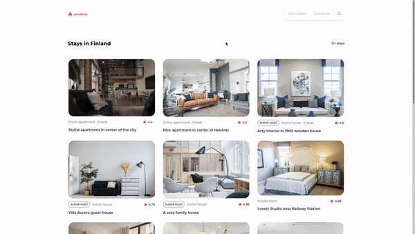

<!-- markdownlint-disable MD033 -->
<!-- markdownlint-disable MD041 -->

<div align="center">
  
</div>

<div align="center">
   Solution for a challenge from  <a href="http://devchallenges.io" target="_blank">Devchallenges.io</a>.
</div>

<div align="center">
  <h3>
    <a href="https://nathan22x3.github.io/windbnb">
      Demo
    </a>
    <span> | </span>
    <a href="#">
      Solution
    </a>
    <span> | </span>
    <a href="https://devchallenges.io/challenges/3JFYedSOZqAxYuOCNmYD">
      Challenge
    </a>
  </h3>
</div>

<!-- TABLE OF CONTENTS -->

## Table of Contents

- [Table of Contents](#table-of-contents)
- [Overview](#overview)
  - [Built With](#built-with)
- [Features](#features)
- [How To Use](#how-to-use)
- [Acknowledgements](#acknowledgements)
- [Contact](#contact)

<!-- OVERVIEW -->

## Overview



### Built With

- [ReactJS](https://reactjs.org/)
- [Redux Toolkit](https://redux-toolkit.js.org/)
- [Tailwind CSS](https://tailwindcss.com/)

## Features

This application/site was created as a submission to a [DevChallenges](https://devchallenges.io/challenges) challenge. The [challenge](https://devchallenges.io/challenges/3JFYedSOZqAxYuOCNmYD) was to build an application to complete the given user stories.

- [x] **User story**: I can see a list of properties
- [x] **User story**: I can see the property card with a name, rating, apartment type, and super host
- [x] **User story**: I can open the filter drawer
- [x] **User story**: I can filter properties by location and number of guests
- [x] **User story**: I can see the number of filtered items
- [x] **User story**: I can see pages following given designs

## How To Use

To clone and run this application, you'll need [Git](https://git-scm.com/) and [Node.js](https://nodejs.org/en/download/) installed on your computer. From your command line:

```bash
# Clone this repository
$ git clone https://github.com/nathan22x3/windbnb

# Move to project directory
$ cd windbnb

# Install dependencies
$ yarn

# Run the app
$ yarn start
```

## Acknowledgements

- [twin.macro](https://github.com/ben-rogerson/twin.macro)

## Contact

- GitHub [@nathan22x3](https://github.com/nathan22x3)
